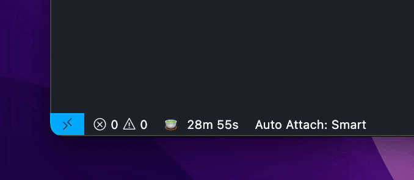
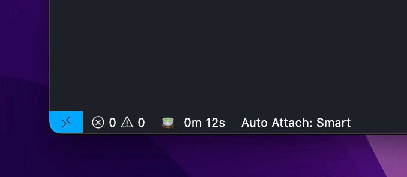
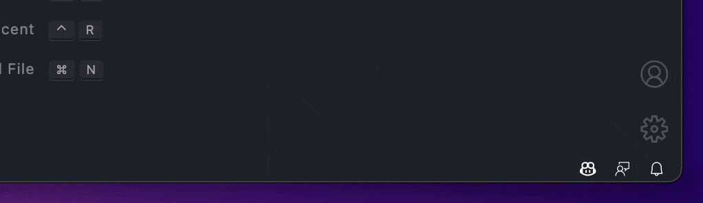
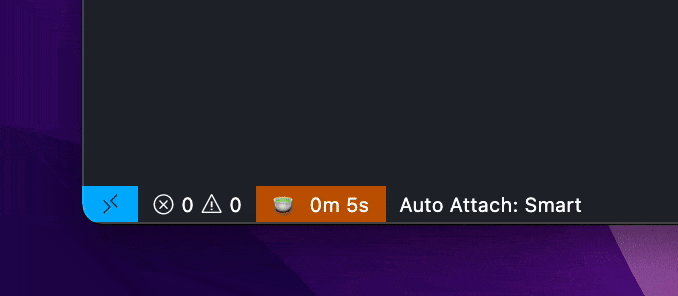
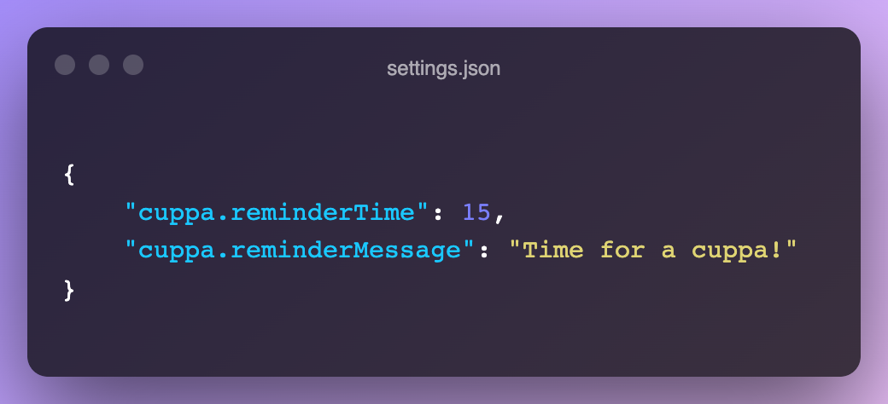
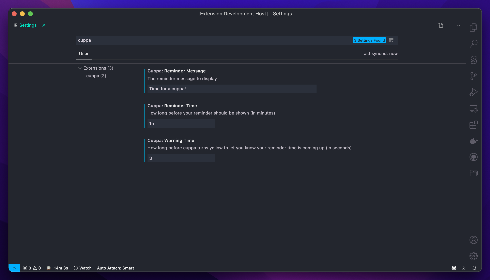

<div id="top"></div>

<!-- https://www.markdownguide.org/basic-syntax/#reference-style-links -->

<!-- TODO -->
<!-- [![Contributors][contributors-shield]][contributors-url]
[![Forks][forks-shield]][forks-url]
[![Stargazers][stars-shield]][stars-url]
[![Issues][issues-shield]][issues-url]
[![MIT License][license-shield]][license-url]
[![LinkedIn][linkedin-shield]][linkedin-url] -->

<br />
<div align="center">
  <a href="https://github.com/alDuncanson/cuppa">
	<!-- TODO -->
    
  </a>
  <p align="center">
    friendly reminders in your editor
    <br />
    <br />
    <a href="https://github.com/alDuncanson/cuppa/issues">Report Bug</a>
    ·
    <a href="https://github.com/alDuncanson/cuppa/issues">Request Feature</a>
  </p>
</div>

## About

TODO

<details>
  <summary>Table of Contents</summary>
  <ol>
    <li><a href="#about-the-project">About</a></li>
		<li><a href="#installation">Installation</a></li>
    <li><a href="#usage">Usage</a></li>
    <li><a href="#usage">Configuration</a></li>
    <li><a href="#roadmap">Roadmap</a></li>
    <li><a href="#contributing">Contributing</a></li>
    <li><a href="#license">License</a></li>
    <li><a href="#contact">Contact</a></li>
    <li><a href="#acknowledgments">Acknowledgments</a></li>
  </ol>
</details>

<p align="right">(<a href="#top">back to top</a>)</p>

## Installation

You can install in one of two ways

#### Visual Studio Marketplace

Visit [cuppa](https://marketplace.visualstudio.com/items?itemName=AlDuncanson.cuppa) and click the `Install` button.

#### VS Code

Type`⌘P` (`⌃P` on Windows) to open **Quick Open** and paste the following:

```
ext install AlDuncanson.cuppa
```

<p align="right">(<a href="#top">back to top</a>)</p>

## Usage

cuppa starts automatically when you open a workspace



when it's almost time (10 seconds left), cuppa will turn yellow to get your attention



when the time is up, you'll receive a notification in the bottom right



just click to reset cuppa!

> Note: you can click to reset cuppa at any time



## Configuration

cuppa is configurable!

You can edit cuppa's time and message with the following configuration keys in your `User/settings.json` file



Or type `⌘⇧P` (`⌃⇧P` on Windows) to open **Command Palette** and type `Preferences: Open Settings (UI)`, then search for `cuppa`



<p align="right">(<a href="#top">back to top</a>)</p>

## Roadmap

- [x] user settings
  - custom reminder time
  - custom reminder message
- [x] command palette commands
  - reset cuppa reminder
- [ ] custom side bar panel

See the [open issues](https://github.com/alDuncanson/cuppa/issues) for a full list of proposed features (and known issues).

<p align="right">(<a href="#top">back to top</a>)</p>

## Contributing

Contributions are **greatly appreciated**.

If you have a suggestion that would make cuppa better, you can open an issue with the tag "enhancement".

Or feel free to fork the project and open a pull request with your suggested changes.

Don't forget to give the project a star! Thanks again!

1. Fork the Project
2. Create your Feature Branch (`git checkout -b feature/AmazingFeature`)
3. Commit your Changes (`git commit -m 'Add some AmazingFeature'`)
4. Push to the Branch (`git push origin feature/AmazingFeature`)
5. Open a Pull Request

<p align="right">(<a href="#top">back to top</a>)</p>

## License

Distributed under the MIT License. See [LICENSE](https://github.com/alDuncanson/cuppa/blob/main/LICENSE) for more information.

<p align="right">(<a href="#top">back to top</a>)</p>

## Contact

Al Duncanson

- [@al_duncanson](https://twitter.com/al_duncanson)
- alexjduncanson@gmail.com

<a href='https://www.buymeacoffee.com/alduncanson' target='_blank'></a>

<p align="right">(<a href="#top">back to top</a>)</p>

## Acknowledgments

- [Choose an Open Source License](https://choosealicense.com)
- [Project badges](https://shields.io)

<p align="right">(<a href="#top">back to top</a>)</p>

[stars-shield]: https://img.shields.io/github/stars/alDuncanson/cuppa.svg?style=for-the-badge
[stars-url]: https://github.com/alDuncanson/cuppa/stargazers
